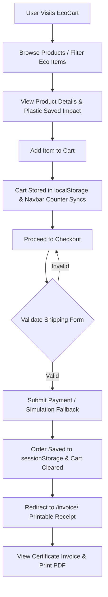

# EcoCart 🌿🛒 — Sustainable E-Commerce & Plastic Offset Platform

**EcoCart** is a modern, nature-infused e-commerce application built to promote eco-friendly consumer habits, track environmental impact, and provide a seamless zero-waste shopping experience. 

Featuring **glassmorphic UI aesthetics**, **floating leaf particle micro-animations**, **real-time plastic offset counters**, **resilient checkout flows**, and **printable order certificates**, EcoCart turns everyday shopping into a positive force for the planet.

---

## ✨ Key Features & Concepts

### 1. 🎨 Nature Glassmorphism Design System
- **Floating Leaf Micro-Animations 🍃**: Built-in CSS particle physics that gently drift leaves across every page background.
- **Emerald Glassmorphism**: Soft backdrop blur panels (`bg-white/85 backdrop-blur-md border border-emerald-100/80`) paired with deep forest gradients (`#064E3B`, `#059669`, `#10B981`).
- **Interactive UI Feedback**: Sprout pop-in animations (`Add to Cart 🌱`), wishlist heart toggles, star rating breakdowns, and responsive sticky navigation headers.

### 2. 🛒 Dynamic Client-Side Cart Manager (`product.js`)
- **`localStorage` Persistence**: Saves cart items locally across user sessions under `ecocart_items`.
- **Real-Time Synchronized Badge**: Instant top-navbar item counter updates across all 14 site pages.
- **Promo Discount Engine**: Applies promo codes (e.g. `ECOSAVE10`) with live price recalculation.

### 3. 💳 Resilient Checkout & Order Processing
- **Shipping Address Validation**: Ensures required delivery fields (Name, Address, City, Zip, Phone) are valid before submission.
- **Graceful Payment Fallback**: Integrated with Stripe SDK with simulated fallback (`•••• 4242`) so test orders never stall or fail due to iframe/card key mismatches.
- **Session Serialization**: Order information is serialized to `sessionStorage` (`lastOrder`) upon checkout completion.

### 4. 📜 Printable Eco Order Invoices
- **Certificate-Style Receipts**: Renders printable order invoices with itemized tables, shipping breakdown, payment verification stamps, and QR receipt indicators.
- **One-Click Printing**: Dedicated print controls with `@media print` layout overrides hiding header navigation and buttons during print/PDF save.

### 5. 📊 Verified Eco Impact & Plastic Saved Metrics
- **Product Impact Badges**: Displays exact plastic saved metrics per item (`plastic_saved_kg`), e.g., *"By buying this, you help save 0.45kg of plastic!"*.
- **Global Impact Counters**: Tracks cumulative trees planted and plastic diverted across the platform.

### 6. 👤 Unified Custom User Management
- **Single Custom User Model (`accounts.CustomUser`)**: Consolidates username, email, phone, gender, profile picture, bio, and shipping address directly on the user model.
- **Dynamic Avatar Fallbacks**: Automatic SVG UI-Avatars integration (`https://ui-avatars.com/api/?name=...`) ensuring clean profile photos even if no image is uploaded.

---

## 📂 Directory Structure

```text
EcoCart/
├── .gitignore
├── README.md
└── ecocart/
    ├── manage.py
    ├── db.sqlite3
    ├── ecocart/
    │   ├── __init__.py
    │   ├── settings.py           # Core Django settings & AUTH_USER_MODEL config
    │   ├── urls.py               # Root URL router
    │   ├── wsgi.py
    │   └── asgi.py
    ├── accounts/                 # User management, auth & static content app
    │   ├── models.py             # CustomUser model definition
    │   ├── views.py              # Profile, Auth, Home, About, Blog, Contact, Invoice views
    │   ├── forms.py              # CustomUserCreationForm & CustomUserChangeForm
    │   ├── urls.py               # Routing for accounts & site pages
    │   ├── templates/accounts/
    │   │   ├── home.html         # Landing page with hero & global impact counters
    │   │   ├── about.html        # Mission, pillars & environmental commitment
    │   │   ├── blog.html         # Eco Journal magazine grid & newsletter
    │   │   ├── contact.html      # Glassmorphic contact form & support info
    │   │   ├── profile.html      # User profile dashboard & avatar uploader
    │   │   ├── wishlist.html     # Saved eco wishlist page
    │   │   ├── login.html        # Glassmorphic login page
    │   │   ├── register.html     # User registration with file upload
    │   │   └── forgot_pass.html # Password reset interface
    │   └── static/accounts/
    │       ├── css/
    │       └── images/
    ├── products/                 # E-Commerce product catalog & cart app
    │   ├── models.py             # Product, Category & Review models
    │   ├── views.py              # Product list, Detail API & Search views
    │   ├── urls.py               # Routing for /products/
    │   ├── templates/products/
    │   │   ├── product_list.html # Shop catalog with category & eco filters
    │   │   ├── product_detail.html# Product detail page & plastic impact box
    │   │   ├── cart.html         # Shopping bag with order summary & promo code
    │   │   ├── checkout.html     # Secure multi-step checkout form
    │   │   └── invoice.html      # Printable order invoice & certificate
    │   └── static/products/
    │       ├── js/
    │       │   └── product.js    # Client-side Cart manager & notification toasts
    │       └── css/
    ├── wishlist/                 # Wishlist app routes & views
    └── media/                    # Uploaded user profile photos & product images
```

---

## 🔄 End-to-End System Workflow



---

## 🚀 Running Locally

### Prerequisites
- Python 3.12 (or Python environment with Django 5.x installed)
- Git

### Setup & Run Commands

1. **Clone the repository**:
   ```powershell
   git clone https://github.com/ridakhan2811/EcoCart.git
   cd EcoCart\ecocart
   ```

2. **Run System Checks**:
   ```powershell
   py -3.12 manage.py check
   ```

3. **Apply Database Migrations**:
   ```powershell
   py -3.12 manage.py migrate
   ```

4. **Start the Development Server**:
   ```powershell
   py -3.12 manage.py runserver
   ```

5. **Open in Browser**:
   Navigate to `http://127.0.0.1:8000/` or `http://127.0.0.1:8000/products/`

---

## 👩‍💻 Project Team

---

### 1. Rutuja Deshmukh

**AI Engineer** building production-grade AI systems.

[](https://rutuja-deshmukh-portfolio.vercel.app/)
[](https://www.linkedin.com/in/rutuja-deshmukh29)
[](https://github.com/RutujaDeshmukh29)

**Stack:** Python · FastAPI · LangGraph · Next.js 15 · pgvector · Groq · Framer Motion · TanStack Query · Zustand

---

### 2. Rida Khan

**Software Developer** passionate about full-stack web applications and sustainable tech solutions.

[](https://github.com/ridakhan2811)
[](https://www.linkedin.com/in/rida-khan-460164350/)

**Stack:** Python · Django · HTML5 / CSS3 · JavaScript (ES6+) · Tailwind CSS · SQLite / PostgreSQL · Git

---

<div align="center">

**If this project helped you, please ⭐ star the repository.**

It helps others discover it and motivates continued development.

</div>
